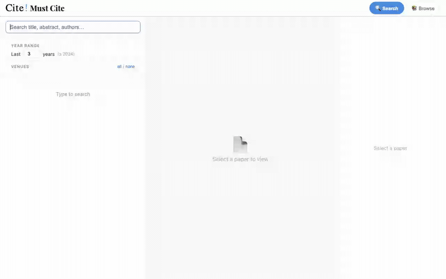

<div id="header" align="center">
    
    <h1>OpenPapers</h1>
</div>


**A scraper and automation pipeline that builds a high-quality, continuously
updated corpus of AI/ML conference and journal papers** — metadata, BibTeX,
and full PDFs — for citation analysis, research recommendation, and dataset
work.

OpenPapers is this scraper/corpus. [mustcite.com](https://mustcite.com) is
the public search and browse engine built on top of it. Add labels and
preprocessing to the same corpus and you get **MasterSet**, our must-cite
citation recommendation benchmark (see [Citation](#citation)).

The rapid growth of AI/ML research has made it increasingly hard to keep up
with new publications. Existing aggregators (Google Scholar, Semantic
Scholar, OpenReview, Paper Copilot) often have incomplete coverage or noisy
metadata, so OpenPapers targets the top-tier venues directly. Coverage
focuses on ~2013 onward (the deep learning era), with earlier years
partially included where available.

**Live:** browse the collected papers at [mustcite.com](https://mustcite.com)
· automation status at [dashboard.mustcite.com](https://dashboard.mustcite.com)



---

## Table of Contents

- [Supported Conferences](#supported-conferences)
- [Quickstart](#quickstart)
- [Automation](#automation)
- [Data Structure](#data-structure)
- [Full CLI Reference](#full-cli-reference)
- [Citation](#citation)
- [Acknowledgements](#acknowledgements)
- [License](#license)
- [Limitations](#limitations)

---

## Supported Conferences

<!-- BEGIN GENERATED COVERAGE -->
- **NeurIPS** (1987–2025)
- **ICML** (2013–2025; provisional: 2026)
- **ICLR** (2013–2026)
- **AAAI** (2010–2026)
- **CVPR** (2013–2026)
- **COLT** (2011–2026)
- **UAI** (2015–2025)
- **JMLR** (2000–2026)
- **AISTATS** (1995, 1997, 1999, 2001, 2003, 2005, 2009–2025; provisional: 2026)
- **IJCAI** (2017–2025; provisional: 2026)
- **ACL** (1979–2026)
- **EMNLP** (1996–2025)
- **NAACL** (2000–2001, 2003–2004, 2006–2007, 2009–2010, 2012–2013, 2015–2016, 2018–2019, 2021–2022, 2024–2025)
- **ICCV** (2013, 2015, 2017, 2019, 2021, 2023, 2025)
- **ECCV** (2018, 2020, 2022, 2024)
<!-- END GENERATED COVERAGE -->

[Full coverage and quality report](./statistics.md) — regenerate with
`python postprocessing/generate_statistics.py --write` after scraping (also
refreshes the marker-delimited list above; don't hand-edit it).

> [!WARNING]
> **KDD**, **TPAMI**, and **ICDM** are not supported — their full metadata or
> PDFs require a subscription or institutional access.

Retains archival main-program content (including configured long, short, and
industry tracks); excludes workshops, demos, tutorials, and other secondary
material.

## Quickstart

```bash
git clone https://github.com/zhangleiniu/OpenPapers.git && cd OpenPapers
python -m venv .venv && source .venv/bin/activate
python -m pip install -r requirements.txt
```

Create a `.env` for optional paths/credentials (only needed for the scrapers
you actually use — see [Full CLI Reference](#full-cli-reference) for the
complete variable list):

```bash
SCRAPER_DATA_ROOT=./data          # default: ./data
OPENREVIEW_USERNAME=you@example.com   # required for OpenReview-gated venues
OPENREVIEW_PASSWORD=your-password
```

Scrape a venue/year:

```bash
python main.py neurips 2022
python main.py iclr 2020 2021 2022        # multiple years
python main.py icml 2023 --no-pdfs        # metadata only
```

List everything available:

```bash
python main.py --list-conferences
```

## Automation

The versioned registry in `automation/conferences.json` describes venue
years and candidate sources. A local-first control plane estimates each
venue/year's event date, sleeps until then, and hands it to an isolated
Codex agent worktree; the maintainer reviews and commits manually. See the
[automation system overview](./docs/automation-system/README.md) for the
architecture, and check [dashboard.mustcite.com](https://dashboard.mustcite.com)
for live per-venue status.

## Data Structure

```
data/
├── metadata/
│   └── conference/
│       └── conference_year.json
└── papers/
    └── conference/
        └── year/
            └── paper_files.pdf
```

## Full CLI Reference

<details>
<summary>Expand for the complete command/flag/environment-variable reference</summary>

### Environment variables

```bash
# Data storage root (default: ./data)
SCRAPER_DATA_ROOT=./data

# Log file path (default: scraper.log in project root)
SCRAPER_LOG_FILE=scraper.log

# Required for AAAI, ACL, EMNLP, NAACL, and IJCAI scrapers (LLM track filtering)
GCP_PROJECT_ID=your-project-id
GCP_LOCATION=us-central1
GEMINI_MODEL=gemini-2.5-flash

# Required for authenticated OpenReview API access and protected PDFs
OPENREVIEW_USERNAME=you@example.com
OPENREVIEW_PASSWORD=your-password
```
See [Google Cloud Setup](./docs/GOOGLE_CLOUD_SETUP.md) for Vertex AI configuration.

### Commands

Fill missing abstracts/authors from already-produced GROBID output, falling
back to Nougat output:
```bash
python main.py acl 2026 --enrich-missing
```

Fail the command if required metadata or downloaded PDF files are incomplete:
```bash
python main.py acl 2026 --enrich-missing --require-complete
```

For a newly announced year whose proceedings are not yet available, validate
the public metadata without treating archival publication as complete:
```bash
python main.py aistats 2026 --no-pdfs --require-complete \
  --completeness-level metadata
```

Completeness levels are `announced` (identity, title, and authors), `metadata`
(also abstract), and `archival` (the default strict metadata/PDF contract).
Years sourced from OpenReview or an official accepted-paper page are marked
`provisional` until reconciled with formal proceedings.

`--enrich-missing` consumes the processed files under
`$SCRAPER_DATA_ROOT/{grobid_output,nougat_output}`; it does not launch the
external, resource-intensive GROBID or Nougat pipelines itself. It is safe to
rerun and only fills empty fields.

Start fresh (ignore existing data):
```bash
python main.py aaai 2024 --no-resume
```

### Source monitoring

A cheap deterministic monitor checks OpenReview, official HTML lists, and
PMLR without invoking an LLM:
```bash
python automation/monitor.py --venue icml --year 2026
```
Runtime hashes, counts, and status are stored separately under
`$SCRAPER_DATA_ROOT/monitor/state.sqlite3`. The installed local service uses
this deterministic monitor for daily change/error coverage; it does not use
the monitor as proof that papers are ready or as authority to run a scraper.

The core scrapers never depend on Prefect, containers, cloud deployment, an
LLM provider, email, or a coding-agent CLI.

### Configuration

Shared settings are defined in `config.py`; venue URLs and venue-specific
delays live in each scraper class: request delays/timeouts, retry attempts,
rate limiting parameters, base URLs per conference.

### Logging

Detailed logs are saved to `scraper.log` with console progress. Use
`--verbose` for debug-level logging.

### Notes

- Some conferences have year-specific scrapers for different website formats.
- PDF downloads are optional and can be skipped for faster metadata collection.
- All scraped data is saved incrementally to prevent data loss.
- BibTeX is generated during scraping. `postprocessing/rebuild_bibtex.py` is
  retained only for rebuilding historical metadata and uses the same
  generator as the live scraper.
- `postprocessing/backfill_missing_metadata_fields.py` remains available for
  independent bulk repair; `--enrich-missing` exposes the same fallback in
  the main CLI.
- See the [documentation index](./docs/index.md),
  [data schema](./docs/data-schema.md), [pipeline](./docs/pipeline.md),
  [current automation deployment](./docs/automation.md), and
  [validation guide](./docs/validation.md).

</details>

## Citation

If you use this project in your research, please cite our paper, accepted at
the 2026 SIAM International Conference on Data Mining (SDM26). The proceedings
DOI and page numbers are not available yet; this entry links to the current
preprint and will be updated after publication.

```bibtex
@inproceedings{ratul2026masterset,
  title     = {{MasterSet}: A Large-Scale Benchmark for Must-Cite Citation Recommendation in the {AI/ML} Literature},
  author    = {Ratul, Md Toyaha Rahman and Chen, Zhiqian and Fu, Kaiqun and Ji, Taoran and Zhang, Lei},
  booktitle = {Proceedings of the 2026 SIAM International Conference on Data Mining (SDM26)},
  year      = {2026},
  url       = {https://arxiv.org/abs/2604.17680}
}
```

## Acknowledgements

We gratefully acknowledge the support of Google Cloud Research Credits for
providing the compute resources used in this project.

## License

The source code in this repository is licensed under the [MIT License](./LICENSE).

The scraper output is not covered by the software license. This project does
not claim ownership of paper metadata, abstracts, or PDFs retrieved from
public conference and publisher websites. Those materials remain subject to
the rights and terms of their respective authors, publishers, and source
websites.

## Limitations

- **Some abstracts are absent from the source pages.** Older proceedings
  pages (notably NAACL 2013/2015/2016 on the ACL Anthology, plus a handful of
  early JMLR and AAAI entries) never recorded abstracts, so a fresh scrape
  leaves those `abstract` fields empty — this is not a scraping bug. These
  gaps can be backfilled from the downloaded PDFs with
  `python postprocessing/backfill_missing_metadata_fields.py --abstract`,
  which extracts the abstract from GROBID TEI output (primary) or Nougat
  markdown (fallback) and records the origin in an `abstract_source` field.
  The generated [quality report](./statistics.md) is the source of truth for
  remaining gaps in the canonical dataset.
